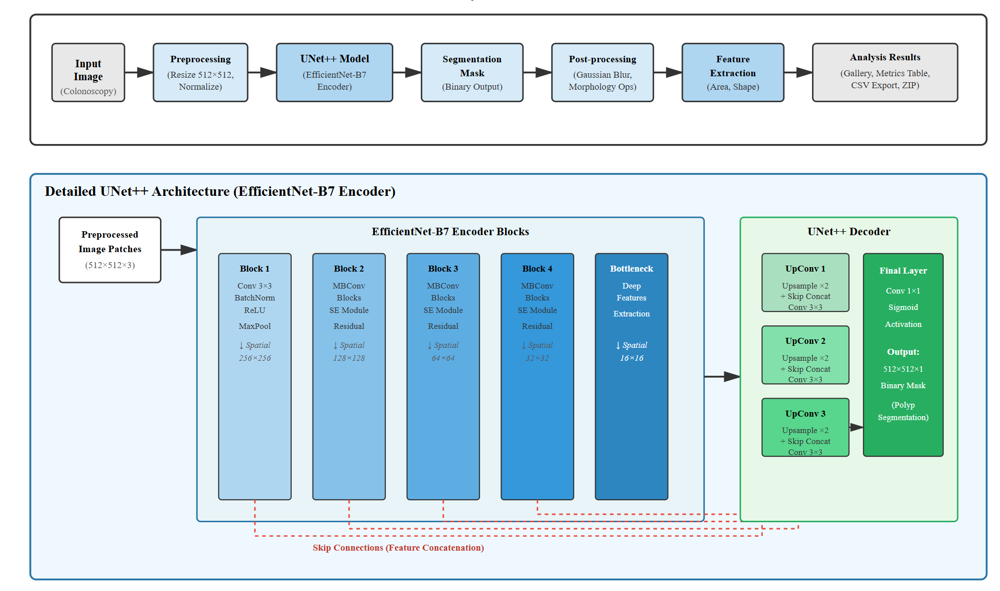

# Colon Polyp Segmentation and Analysis using Deep Learning

This project presents an AI-based system for automatic colon polyp segmentation and morphological analysis using a **U-Net++ architecture with an EfficientNet-B7 encoder**.  
The system performs **pixel-wise segmentation**, extracts **quantitative shape features**, and provides **visual and tabular results** through a user-friendly interface.

---

## Project Highlights

- Deep learning–based **pixel-level polyp segmentation**
- **U-Net++ with EfficientNet-B7 encoder** for multi-scale feature learning
- Automatic **morphological analysis** (area, shape, coverage, confidence)
- Clean **visual overlays**, **binary masks**, and **CSV reports**
- Strong **generalization on unseen test data**

---

## System Architecture

The overall pipeline of the proposed system is shown below:

### Pipeline Flow
- Colonoscopy image input  
- Preprocessing (resize & normalization)  
- U-Net++ segmentation model  
- Binary mask generation  
- Post-processing (smoothing & morphology)  
- Feature extraction  
- Visualization and result export  

---

## Model Architecture (U-Net++ with EfficientNet-B7)

- **Encoder:** EfficientNet-B7  
- **Decoder:** U-Net++ with nested skip connections  
- **Output:** Binary segmentation mask (polyp vs background)  

This architecture captures:
- Fine spatial details (edges, boundaries)
- High-level semantic features (polyp regions)

---

## Dataset Preparation

Multiple public colonoscopy datasets were merged to improve robustness.

### Dataset Split

- Split ratio: **80% Train / 10% Validation / 10% Test**
- Test set is **completely unseen during training**

---

## Evaluation Metrics

Since this is a pixel-wise segmentation task, evaluation is done at the **pixel level**.

### 🔹 Intersection over Union (IoU)

\[
IoU = \frac{TP}{TP + FP + FN}
\]

- Measures overlap between predicted mask and ground truth
- Higher IoU ⇒ better boundary alignment

---

### 🔹 F1 Score (Dice Coefficient)

\[
F1 = \frac{2 \times TP}{2 \times TP + FP + FN}
\]

- Balances false positives and false negatives
- Well suited for **medical image class imbalance**

---

## Quantitative Test Results

From the held-out test dataset:

- **Test IoU:** 0.8910  
- **Test F1 / Dice Score:** 0.9356  

These scores confirm **high segmentation accuracy** and **strong generalization**.

---

## Confusion Matrix (Test Set)

The pixel-wise confusion matrix shows detailed prediction behavior:
- High **True Positives** → accurate polyp detection
- Low **False Negatives** → fewer missed polyps
- Balanced performance across foreground and background pixels

---

## Segmentation & Visualization Results

The system provides three visual outputs:

- **Original Image**
- **Overlay Image**
  - 🔴 Red → Polyp region
  - 🟢 Green → Background
- **Binary Mask**
  - White → Polyp
  - Black → Background

Users can also **download all masks as a ZIP file**.

---

## Quantitative Analysis Table

For each image, the system computes:

- Polyp Count  
- Polyp Area (pixels)  
- **Solidity** – compactness of the polyp region  
- **Eccentricity** – how elongated the polyp shape is  
- Coverage (%)  
- Aspect Ratio  
- Confidence (%)  

These metrics support **objective morphological assessment**.

---

## User Interface (Gradio App)

The project includes a simple web interface:

- Upload colonoscopy images
- Click **Run Segmentation**
- View overlays, masks, and metrics
- Download **CSV reports** and **ZIP masks**

---

## Applications

- Clinical decision support during image review
- Improved detection consistency across patients
- Automated documentation & reporting
- Educational tool for medical students and trainees

---

## Conclusion

- The project successfully demonstrates the use of deep learning for medical image segmentation.
- The system provides a **reliable, consistent, and automated pipeline** from image input to quantitative analysis.
- Experimental results confirm **high accuracy and strong generalization**, reducing manual effort and subjectivity.

---

## Future Enhancements

- Real-time video-based colonoscopy segmentation
- Polyp severity or malignancy classification
- Integration with hospital clinical systems
- Deployment on cloud or edge devices
